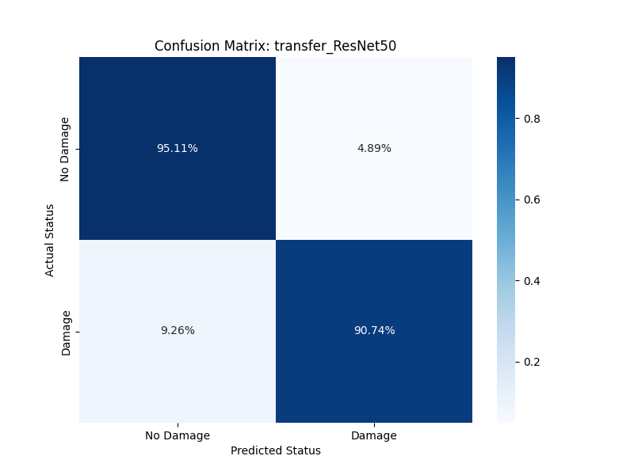

# Data Sciene Project: Hurricane Damage Detection

## Objective
This is a deep learning project I started to work on in the scope of my Data Science education. The goal was to use transfer learning to build a computer vision tool that could identigy damage from post-hurricane satellite imagery. Here I use the "Satellite Images of Hurricane Damage" dataset from Kaggle.

## Methodology & Model Selection

Several architectures using Transfer Learning on ImageNet weights were compared. Two metrics were prioritized:

**Recall (Damage Class):** Because failing to find a damaged building is a higher risk than a false alarm.

**F1-Score:** To ensure the model maintains a healthy balance between precision and recall.

## Results & Discussion

### Initial Model Performances (Validation Set)

| Model | Val Accuracy | Val Precision | Val Recall | Val F1 |
| :--- | :--- | :--- | :--- | :--- |
| **ResNet50** | 0.9225 | 0.9202 | 0.9270 | 0.9236 |
| **EfficientNetB0** | 0.8966 | 0.8978 | 0.8978 | 0.8978 |
| **VGG16** | 0.8892 | 0.8639 | 0.9270 | 0.8943 |
| **MobileNetV2** | 0.8376 | 0.8974 | 0.7664 | 0.8267 |

**ResNet50** seemed to be the best performing model.
**Suspicious convergence:** VGG16, ResNet50 and EfficientNetB0 although having different architectures achieved very high performance markers on the first try.
    + Were the models really learning to recognize damage, or something else?

### In depth performance ResNet50 (Test Set)
A closer look at the ResNet50 performance on test data showed comparabale performance with a f1-score of 93% and ~91% damage recall.

From experience a drop in model performance was expected. This again fueled suspicion about these results.

### Spacial Data Leakage
Analyzing the geospatial data in the train and test image filenames revealed that 41% of the test data sat within a 110 meter rage from a training sample. This proximity allowed the models to "memorize" specific streets rather than generalize damage features.

## Next Steps

+ Reorganize data in a **Spatial Grid Split** (1.1 km blocks).Forces model to look at neighborhoods it has never seen before.
+ Retrain ResNet50 on this data
+ Compare and evaluate